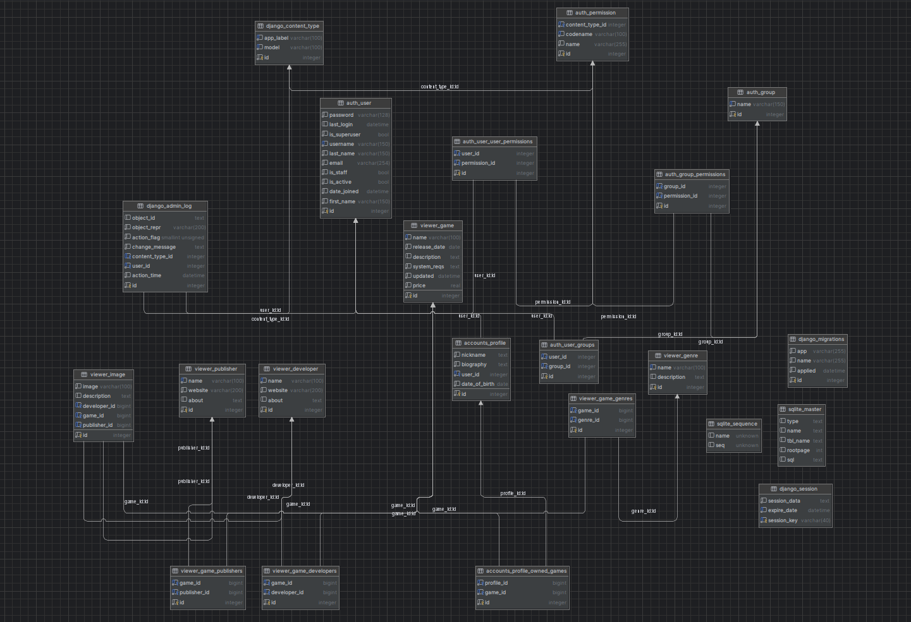

# Project Video Game E-shop
This is a pretty rudimentary attempt at a project that's supposed to be a version of sort of an online video game e-shop
with some account features, a database and whole lot of potential updates I simply didn't have time or knowledge to do yet.
Created for the SDA Academy Python course.

## Features
- [x] 1 List of games
- [x] 2 Individual game page
  - [ ] 1 additional content (DLC?)
  - [ ] 2 reviews
- [x] 3 Adding new games
- [x] 4 Accounts
  - [x] 1 buying Games
  - [x] 2 Admins - uploading Games
  - [x] 3 basic account features (profile pictures, bio, etc.)
  - [x] 4 list of uploaded games
  - [ ] 5 account comments
- [x] 5 Searching / filtering games
  - [x] 1 genres
  - [ ] 2 year of publishing
  - [x] 3 name
  - [x] 4 developer / publisher
  - [x] 5 description
- [ ] 6 Sales
- [ ] 7 Preorders
  - [ ] ? Early access?
- [x] 8 Home Page
  - [x] 1 new releases
  - [ ] 2 popular bestsellers
  - [ ] 3 for you
- [x] 9 Owned game library
- [ ] 10 Searching library
  - [ ] 1 genres
  - [ ] 2 year of publishing
  - [ ] 3 name
  - [ ] 4 developer / publisher
  - [ ] 5 description
  - [ ] 6? status (installed/downloading/neither)
- [x] 11 Publishers and Developers
- [x] 12 Images

## Database

- [x] User (Django?)
- [x] Genre
- [x] Profile
  - [x] User (1:1 -> User)
  - [x] Name (String)
  - [x] Birth_date (Date)
  - [x] Description (String)
  - [x] Owned_games (n:n -> Game)
- [x] Game
  - [x] Name (String)
  - [x] Genre (String)
  - [x] Box_art (1:1 -> Image)
  - [x] Price (Float)
  - [x] Developer (n:n -> DeveloperGroup)
  - [x] Publisher (n:n -> PublisherGroup)
  - [x] Date_of_release (Date)
  - [x] Description (String)
  - [x] System_requirements (String)
  - [x] Updated (Date)
- [x] Image
  - [x] Image_file (File)
  - [x] Game (1:1 -> Game Box_art)
  - [x] Description (String)
- [x] DeveloperGroup
  - [x] Games (n:n -> Game)
  - [x] Name (String)
  - [x] Official Website (URL)
  - [x] About (String)
- [x] PublisherGroup
  - [x] Games (n:n -> Game)
  - [x] Name (String)
  - [x] Official Website (URL)
  - [x] About (String)